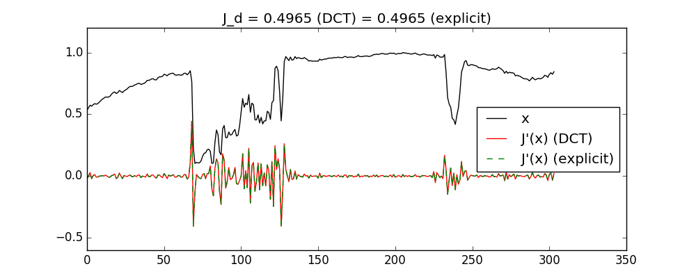

# fastDiff
fast (DCT-based) differential

Examples:
 case 1: show impulse response function
 

 case 2: greyscale image differentiation in one or more dimensions
 

 case 3: colour image differentiation in one or more dimensions
 

 case 4: use to get J and J' for differential operator
 

