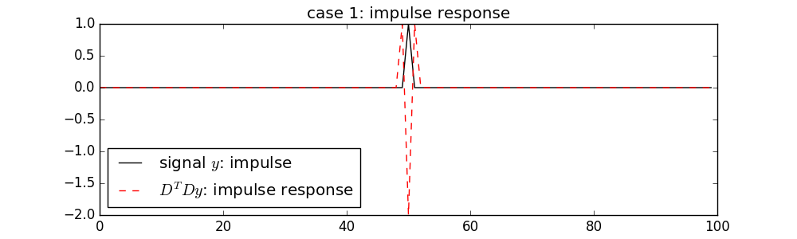
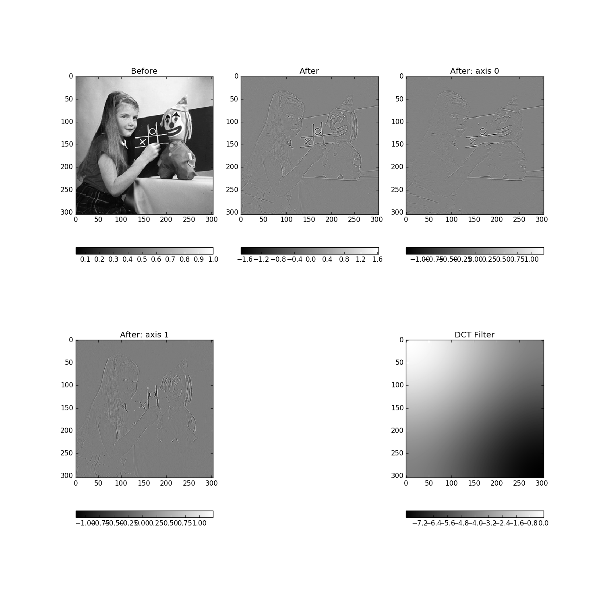
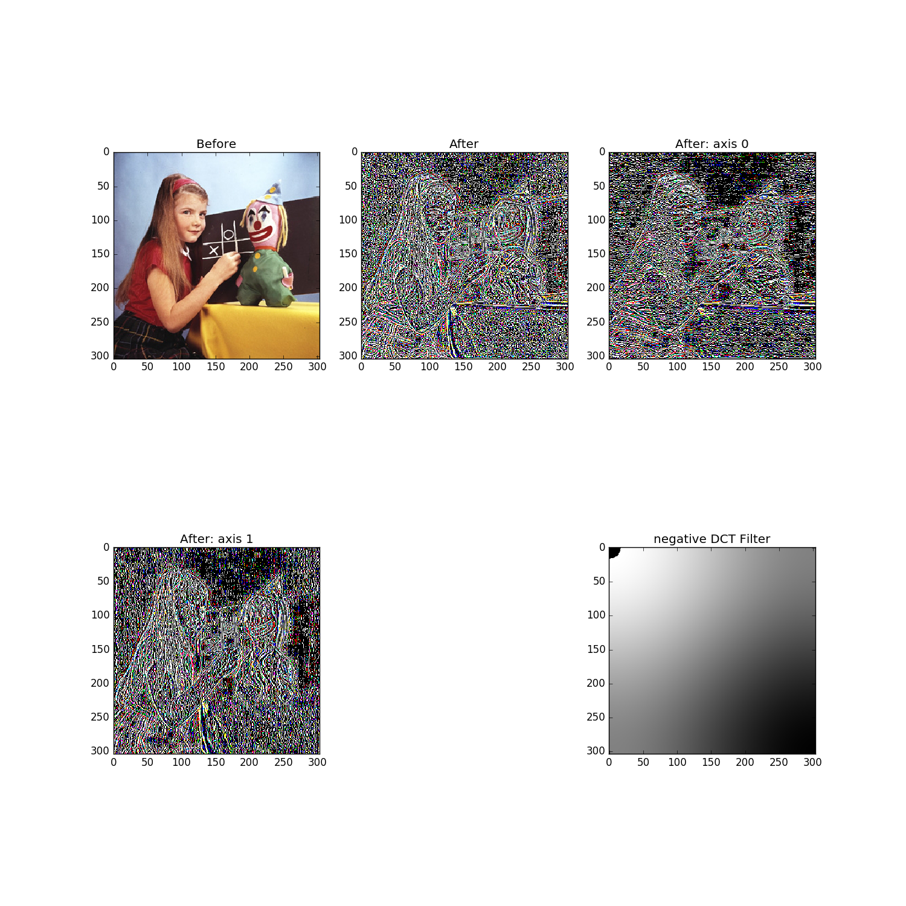

# fastDiff
fast (DCT-based) differential

class fastDiff(__builtin__.object)
 |  fastDiff: class for fast 2nd O differentiation of a gridded dataset
 |  
 |  Methods defined here:
 |  
 |  __init__(self, y, thresh=1e-10, yshape=None, smoothOrder=1.0, axis=None)
 |      load gridded dataset y  and yshape (in case y is flattened)
 |      
 |      thresh:
 |        method has some rounding issues so threshold as thresh
 |  
 |  dctND(self, data, f=<function dct>, axis=None)
 |  
 |  diff(self, y=None)
 |      differentiate y (or loaded y)
 |  
 |  diffFilter(self)
 |      DCT-II filter for DT D
 |  
 |  ----------------------------------------------------------------------
 |  Data descriptors defined here:
 |  
 |  __dict__
 |      dictionary for instance variables (if defined)
 |  
 |  __weakref__
 |      list of weak references to the object (if defined)

Examples:
 case 1: show impulse response function
 

 case 2: greyscale image differentiation in one or more dimensions
 

 case 3: colour image differentiation in one or more dimensions
 

