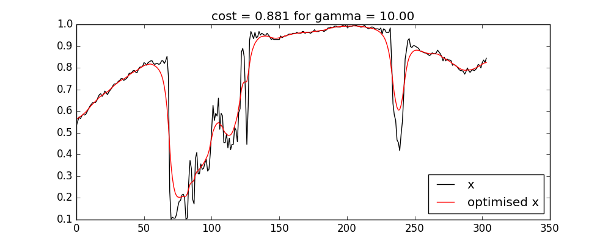

# fastDiff
fast (DCT-based) differential

Examples:
  case 5: use the class in an optimisation. In  this example, we have an identity operator, plus gamma times a differential operator. We use a fastDiff method for J and J'.
  
  This involves:
  
  1. Define some utilities:
  
          def cost_identity(x,xobs):
            J_ = x - xobs
            J =  0.5 * np.dot(J_,J_)
            return J,J_
            
          def fun_dfun(x,xobs,diff):
            J,J_ = cost_identity(x,xobs)
            J1,J1_ = diff.cost_der_cost(x)
            return J + J1,J_ + J1_

  
 2. main code
  
        from PIL import Image
        import urllib2
        from fastDiff import fastDiff
        from scipy.optimize import minimize

        # pull a dataset and make it 1D for now
        url='https://upload.wikimedia.org/wikipedia/en/0/04/TCF_centre.jpg'
        im = np.array(Image.open(urllib2.urlopen(url)).convert("L")).astype(float)[50]
        x = im/im.max()
      
        gamma = 10.
        diff = fastDiff(x,axis=(0,),gamma=gamma)
        res = minimize(fun_dfun, x, jac=True, method='Newton-CG',\
                options={'disp': True},\
                args=(x,diff))

    
   3. Result
   
           Optimization terminated successfully.
             Current function value: 0.881144
             Iterations: 11
             Function evaluations: 12
             Gradient evaluations: 130
             Hessian evaluations: 0

  
  

 case 1: show impulse response function
 

 case 2: greyscale image differentiation in one or more dimensions
 

 case 3: colour image differentiation in one or more dimensions
 

 case 4: use to get J and J' for differential operator
 

